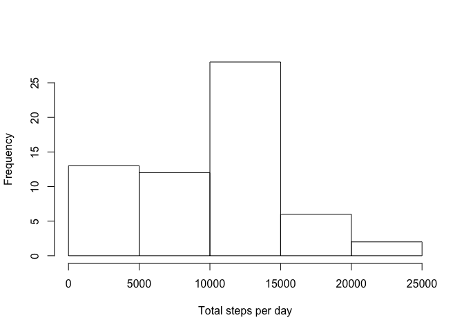
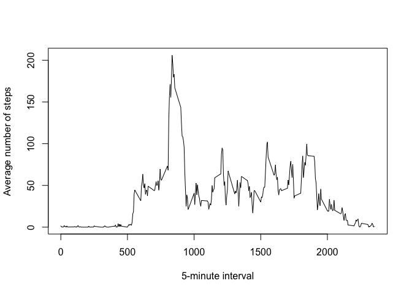
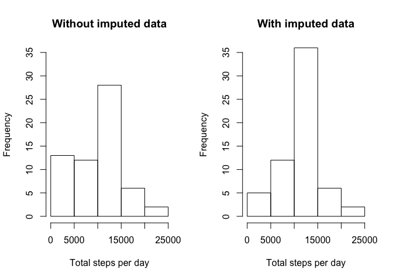
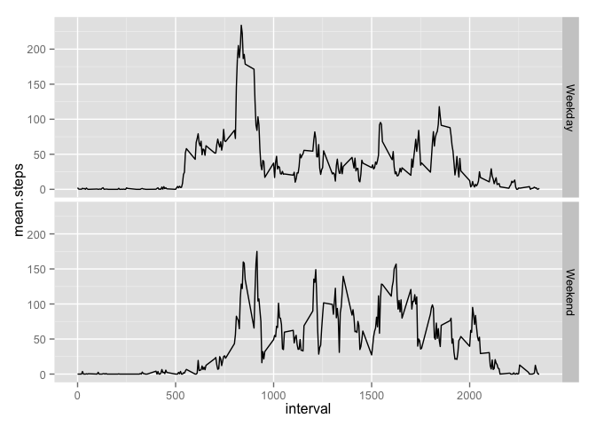

# Reproducible Research: Peer Assessment 1


## Loading and preprocessing the data

#### 1. Load the data (i.e. read.csv())


```r
# load data from csv
activity <- read.csv('activity.csv')
```

#### 2. Process/transform the data (if necessary) into a format suitable for your analysis

```r
# transform date into a date data type
activity$date <- as.Date(activity$date, "%Y-%m-%d")
```


## What is mean total number of steps taken per day?

#### 1. Calculate the total number of steps taken per day

```r
# use dplyr package to summarize data
library(dplyr)
steps.per.day <- group_by(activity, date) %>% summarise(steps = sum(steps, na.rm=TRUE))
```

#### 2. If you do not understand the difference between a histogram and a barplot, research the difference between them. Make a histogram of the total number of steps taken each day

A histogram represents the count of occurances of the variable on the x-axis
that falls into each "bin."

A box plot is a representation of the distribution of the variable showing
the minimum, maximum, median, 1st quartile, and 3rd quartile.


```r
hist(steps.per.day$steps, xlab='Total steps per day', main='')
```

 

#### 3. Calculate and report the mean and median of the total number of steps taken per day

```r
mean.steps <- mean(steps.per.day$steps, na.rm=TRUE)
median.steps <- mean(steps.per.day$steps, na.rm=TRUE)
```
The mean steps per day is 9354.23 while the median
steps per day is 9354.23. 


## What is the average daily activity pattern?
#### 1. Make a time series plot (i.e. type="l") of the 5-minute interval (x-axis) and the average number of steps taken, averaged across all days (y-axis)

```r
steps.per.interval <- group_by(activity, interval) %>% summarize(mean = mean(steps, na.rm=TRUE))
plot(steps.per.interval, type='l', xlab='5-minute interval', 
  ylab='Average number of steps')
```

 

#### 2. Which 5-minute interval, on average across all the days in the dataset, contains the maximum number of steps?

```r
  max.mean <- steps.per.interval[which.max(steps.per.interval$mean),]
```
The 5-minute interval with the maximum number of steps (on average) is the
835 5-minute interval with a maximum mean number of steps
of 206.1698.

## Imputing missing values

#### 1. Calculate and report the total number of missing values in the dataset (i.e. the total number of rows with NAs)

```r
summary(activity) # just to get an idea of where the NAs are?
```

```
##      steps             date               interval     
##  Min.   :  0.00   Min.   :2012-10-01   Min.   :   0.0  
##  1st Qu.:  0.00   1st Qu.:2012-10-16   1st Qu.: 588.8  
##  Median :  0.00   Median :2012-10-31   Median :1177.5  
##  Mean   : 37.38   Mean   :2012-10-31   Mean   :1177.5  
##  3rd Qu.: 12.00   3rd Qu.:2012-11-15   3rd Qu.:1766.2  
##  Max.   :806.00   Max.   :2012-11-30   Max.   :2355.0  
##  NA's   :2304
```

```r
nrows.w.NA <- sum(is.na(activity$steps) + 0)
# could also use complete.cases so do not have to care where the NAs may be
nrows.w.NA2 <- sum(!complete.cases(activity) + 0)
# make sure they are the same
nrows.w.NA == nrows.w.NA2
```

```
## [1] TRUE
```

There are 2304 rows of data containing NAs in the steps variable.

#### 2. Devise a strategy for filling in all of the missing values in the dataset.  The strategy does not need to be sophisticated. For example, you could use the mean/median for that day, or the mean for that 5- minute interval, etc.

```r
# use mean steps in each interval to substitute wherever it is missing
impute.mean <- function(a) {
  which.NA <- which(!complete.cases(a))
  intervals <- a[which.NA, 'interval']
  means <- select(filter(steps.per.interval, interval %in% intervals), mean)
  a[which.NA, 'steps'] <- means
  a
}
```

#### 3. Create a new dataset that is equal to the original data set but with the missing data filled in.

```r
activity.imputed <- impute.mean(activity)
```

#### 4. Make a histogram of the total number of steps taken each day and Calculate and report the mean and median total number of steps taken per day. Do these values differ from the estimates from the first part of the assignment? What is the impact of imputing missing data on the estimates of the total daily number of steps?

```r
steps.per.day.imputed <- group_by(activity.imputed, date) %>% 
  summarise(steps = sum(steps, na.rm=TRUE))
# plot 2 col plots with histograms with and without imputed data
par(mfrow = c(1,2))
hist(steps.per.day$steps, xlab='Total steps per day',
  main='Without imputed data', ylim=c(0,35))
hist(steps.per.day.imputed$steps, xlab='Total steps per day', 
  main='With imputed data', ylim=c(0,35))
```

 

Note the difference in histograms, especially in the 0-5000 bin decreasing
when imputed data is added.  This is primary due to days that had zero steps
recorded (i.e. all missing) not be replaced with average values.

The mean steps per day is 9354.23 and
10766.19 for the as received
and imputed data respecively while the median steps per day is 
10395 and 
10766.19 for the as received 
and imputed data respecively.

## Are there differences in activity patterns between weekdays and weekends?

#### 1. Create a new factor variable in the dataset with two levels – “weekday” and “weekend” indicating whether a given date is a weekday or weekend day.

```r
# fucn to categorize day weekend or weekday
cat.day <- function(date) {
  if (grepl('^S', weekdays(date))) 'Weekend' else 'Weekday'
}
activity <- mutate(activity, day_type = factor(sapply(activity$date, cat.day)))
```

#### 2. Make a panel plot containing a time series plot (i.e.type="l") of the 5-minute interval (x-axis) and the average number of steps taken, averaged across all weekday days or weekend days (y-axis). See the README file in the GitHub repository to see an example of what this plot should look like using simulated data.

```r
  steps.per.day.type <- group_by(activity, interval, day_type) %>% 
    summarise(mean.steps = mean(steps, na.rm=TRUE))
  library(ggplot2)
  g <- ggplot(steps.per.day.type, aes(x=interval, y=mean.steps))
  g <- g + geom_line()
  g <- g + facet_grid(day_type ~ .)
  g
```

 
